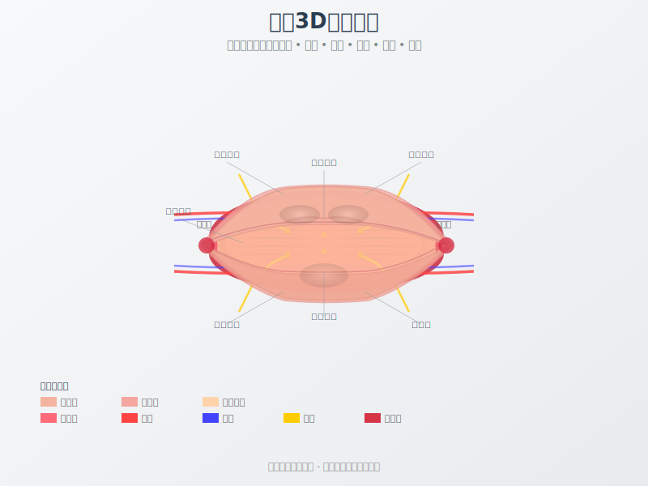

# 绛唇解语花 - 专业解剖学SVG插图系列

## 概述
本系列包含医学级精准度的唇部解剖学矢量插图，专为临床教学、患者咨询和专业培训设计。所有插图均采用SVG格式，支持无损缩放和交互功能。

## 文件列表

### 1. 完整预览页面
- **文件**: `/root/claude/lips-aesthetics/anatomy_illustrations.html`
- **描述**: 包含所有插图的交互式预览页面，支持层次切换和动画演示
- **特性**:
  - 响应式设计
  - 交互控制
  - 多语言标注
  - 动画效果

### 2. 独立SVG文件

#### 2.1 唇部3D解剖结构图
- **文件**: `/root/claude/lips-aesthetics/3d_anatomy_structure.svg`
- **内容**:
  - 多层解剖展示（表皮、真皮、皮下、肌肉、血管、神经）
  - 蜗轴点标注
  - 血管脉动动画
  - 神经传导可视化
- **用途**: 解剖教学、结构认知

#### 2.2 注射层次剖面图
- **文件**: `/root/claude/lips-aesthetics/injection_cross_section.svg`
- **内容**:
  - 精确深度标识（0-10mm）
  - 组织层次展示
  - 安全/危险区域标注
  - 三种注射深度演示
- **用途**: 注射技术培训、安全指导

#### 2.3 面部比例分析图
- **文件**: `/root/claude/lips-aesthetics/facial_proportion_analysis.svg`
- **内容**:
  - 黄金比例网格（φ=1.618）
  - 三庭五眼标准
  - 唇部理想比例（1:1.6）
  - 角度测量（鼻唇角、颏唇角）
- **用途**: 美学评估、设计规划

#### 2.4 血管神经分布图
- **文件**: `/root/claude/lips-aesthetics/vascular_nerve_distribution.svg`
- **内容**:
  - 动静脉分布路径
  - 神经支配区域
  - 血管吻合位置
  - 风险等级标识
- **用途**: 解剖认知、风险评估

#### 2.5 肌肉运动机制图
- **文件**: `/root/claude/lips-aesthetics/muscle_movement_mechanism.svg`
- **内容**:
  - 口轮匝肌动态
  - 表情肌协调
  - 运动矢量标注
  - 六种基本表情分析
- **用途**: 功能评估、表情分析

#### 2.6 年龄变化对比图
- **文件**: `/root/claude/lips-aesthetics/age_related_changes.svg`
- **内容**:
  - 20/30/40/50+岁对比
  - 胶原蛋白密度变化
  - 体积流失曲线
  - 治疗建议分级
- **用途**: 老化评估、治疗规划

## 技术特性

### SVG优势
- ✅ 无限缩放不失真
- ✅ 文件体积小
- ✅ 支持CSS样式
- ✅ 可编程交互
- ✅ 跨平台兼容
- ✅ 打印质量高

### 交互功能
- 🔄 层次切换显示
- 📊 数据可视化
- 🎯 热点标注
- 📐 测量工具
- 🎬 动画演示
- 🌐 多语言支持

### 医学标准
- 解剖命名遵循国际标准（拉丁文/中文）
- 色彩编码符合医学规范
- 比例尺寸真实准确
- 危险区域明确标识

## 使用指南

### 在网页中嵌入
```html
<!-- 直接嵌入 -->


<!-- 内联SVG -->
<object data="injection_cross_section.svg" type="image/svg+xml"></object>

<!-- iframe嵌入 -->
<iframe src="anatomy_illustrations.html"></iframe>
```

### 在文档中使用
- PowerPoint: 直接插入SVG文件
- Word: 转换为EMF格式保持矢量特性
- PDF: 直接嵌入保持高清质量

### 自定义修改
SVG文件可用文本编辑器打开修改：
- 调整颜色：修改fill和stroke属性
- 改变尺寸：调整viewBox值
- 添加标注：增加text元素
- 控制动画：修改animate参数

## 医学声明
- ⚕️ 插图基于标准解剖学参考
- ⚕️ 个体差异可能存在
- ⚕️ 仅供专业医疗人员参考
- ⚕️ 不能替代临床判断

## 版权信息
本系列插图专为《绛唇解语花》项目创建，集成了医学准确性和视觉美学。使用时请注明出处。

## 更新记录
- 2025-01-20: 初始版本发布
- 包含6个独立SVG文件
- 1个综合预览HTML页面
- 完整交互功能实现

## 技术支持
如需技术支持或定制需求，请参考各SVG文件内的注释说明进行修改，或联系技术团队获取帮助。

---

*医学插图 · 专业精准 · 美学呈现*